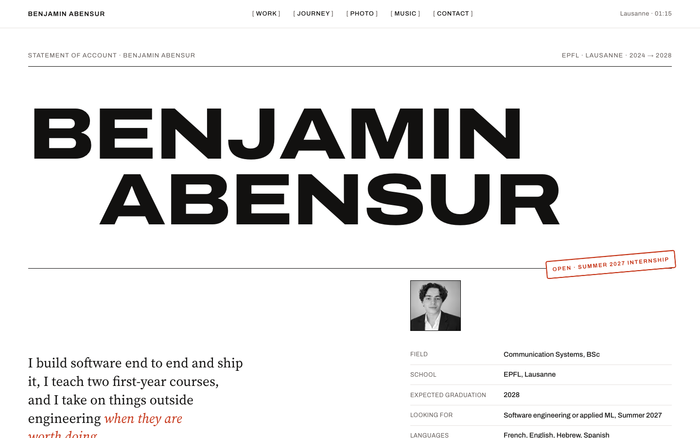

# Benjamin Abensur — portfolio

One-page portfolio, direction **02 · Relevé**: an engineer's statement of account. White paper, black ink, rules, one red stamp, and every project reduced to its proof (one number each).



## Stack

- **Next.js 16** (App Router, TypeScript), plain CSS with design tokens
- **GSAP 3** + ScrollTrigger via `@gsap/react`, **Lenis** for smooth scroll
- `next/font` for Archivo (variable, width axis) and Source Serif 4 (optical size)
- Generated Open Graph image, favicon, robots and sitemap from the App Router metadata API
- Deployed on Vercel

## Content

Everything the site says lives in `content/*.ts`, typed by `content/types.ts`. Change a text, a number or add a project there; the components never hard-code copy.

| File | What it holds |
| --- | --- |
| `content/site.ts` | name, description, links, navigation |
| `content/profile.ts` | hero statement, stamp, facts, photo |
| `content/projects.ts` | the five numbered case studies and the compact list |
| `content/journey.ts` | the numbered timeline |
| `content/music.ts` | tracks and their `src` (see `public/audio/README.md`) |
| `content/photos.ts` | contact-sheet frames (see `public/photos/README.md`) |

Every figure comes from the CV and holds up in an interview; nothing is invented. Placeholders (photos, unreleased masters) say so instead of pretending.

## Motion

- Preloader counter 0 → 100 that widens on Archivo's width axis, then a curved curtain hands over to the hero.
- Hero name printed on the width axis (62 → 125), compressed again on scroll.
- Scroll reveals (once), count-up metrics, custom cursor and magnetic buttons on fine pointers only.
- `prefers-reduced-motion`: no preloader, no smooth scroll, no kinetic type, marquee scrolls by hand; the content is identical.

## Run

```bash
npm install
npm run dev      # http://localhost:3000
npm run build && npm start
```

## Design exploration

The four mockups that preceded this build are in [`maquettes/`](maquettes/): Sodium, Relevé, Porteuse, Cobalt. Relevé won.
